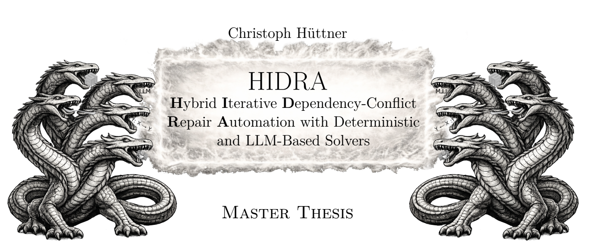

This repository contains the implementation used in my Master’s thesis. The thesis investigates how dependency updates (in particular API-breaking changes) can be addressed by automatically modifying project source code. Instead of trying to select a “perfect” dependency version, HIDRA focuses on repairing the project so it compiles and builds again against an updated library version.

The tool is evaluated on containerized, reproducible update scenarios (based on BUMP) and targets primarily build / compilation errors (e.g., missing or changed symbols) that occur after updating a dependency.

## Concept

HIDRA follows a staged repair strategy:

- Categorization: each failure is classified by whether it appears automatically solvable and by which mechanism.
- Deterministic solver: applies rule-based fixes for high-confidence, recurring patterns.
- LLM solver: proposes patches for complex cases that require broader context or non-trivial code changes.

## Approach (Pipeline)

1. Extract dependency metadata and (if available) the corresponding Maven source JARs using `mavenSourceLinkPre` and `mavenSourceLinkBreaking`.
2. Verify that the baseline reproduction works (`preCommitReproductionCommand`).
3. Extract the project source code and all dependencies from the broken container.
4. Execute `breakingUpdateReproductionCommand` and collect the failing build logs.
5. Determine whether the observed errors are likely fixable via source code modification.
6. For each error, extract context (e.g., target class, target method, parameters, call site information).
7. Generate fixes:
    - trivial patterns: deterministic rules
    - complex patterns: LLM-guided repair (bounded retries)
8. Inject the fix into the broken container (patched sources/classes).
9. Re-run the container to validate the result.

## Requirements

- Docker
- An LLM backend:
    - Ollama (local), or
    - OpenAI (API key)

If you use Ollama, pull the required models beforehand (e.g., `ollama pull <model>`).

## Usage

### 1) Prepare a working folder

Create a local folder with any name, henceforth referred to as `workFolder`.

Inside `workFolder`, create a folder with any name, henceforth referred to as `bumpFolder`.

Inside `bumpFolder`, add one JSON file per project with the following format:

```
{
    "project": "<github_project>",
    "updatedDependency": {
        "dependencyGroupID": "<group id>",
        "dependencyArtifactID": "<artifact id>",
        "previousVersion": "<label indicating the previous version>",
        "newVersion": "<label indicating the new version>",
        "mavenSourceLinkPre": "<maven source jar link for the previous release (optional)>",
        "mavenSourceLinkBreaking": "<maven source jar link for the breaking release (optional)>",
        "updatedFileType": "JAR"
    },
    "preCommitReproductionCommand": "docker run <preCommitImage>",
    "breakingUpdateReproductionCommand": "docker run <breakingImage>"
}
```

Notes:
- The reproduction commands should be deterministic (pin image tags/digests if possible).
- Source JAR links improve analysis quality but may be omitted if unavailable.

### 2) Create the global config

Inside `workFolder`, create a JSON file with any name, henceforth referred to as `jsonConfig`.
In `jsonConfig`, specify:

```
{
    "pathToBUMPFolder": <path to folder containing BUMP jsons>,
    "threads": <number of parallel threads>,
    "maxIterations": <maximum amount of iterations before pruning a branch>,
    "maxRetries": <maximum amount of retries>,
    "pathToOutput": <path to output folder>,
    "llmProvider": <ollama|openai>,
    "ollamaUri": <uri to access ollama, for example: http://localhost:11434>,
    "llmName": <llm name, for example: qwen3-coder:480b-cloud>,
    "dockerHostUri": <uri to access docker, for example: tcp://localhost:2375>,
    "dockerUsername": <optional docker username>,
    "dockerPassword": <optional docker password>,
    "dockerRegistryUri": <optional docker registry uri>,
    "wordSimilarityModel": <text encoder model, for example: nomic-embed-text>,
    "llmApiKey": "<api key if llm provider is openai>",
    "disabledPromptComponents": <Set of disabled LLM prompt components>,
    "temperature": <LLM temperature from 0 to 1>
}
```

### 3) Run HIDRA
```
docker run --rm \
-v <pathToWorkFolder>:/app/<workFolder> \
chrhuettner/hidra:1.0 \
bump /app/<workFolder>/<jsonConfig>
```

## Outputs and Caching

The program automatically generates folders for caching and intermediary results. Patched / fixed classes are located in the `result` folder, subdivided by project.

To speed up repeated runs, you may copy these folders into your `workFolder` beforehand:

- downloaded
- oldContainerLogs
- projectSources
- brokenClasses

This avoids re-downloading and re-extracting inputs.

## Attribution

- API difference computation: https://github.com/siom79/japicmp
- Source code analysis: https://spoon.gforge.inria.fr/
- Bytecode analysis of compiled dependencies and JRE: https://asm.ow2.io/
- Benchmarking dataset / workflow basis: https://github.com/chains-project/bump